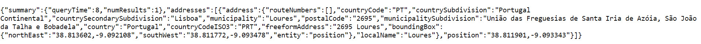
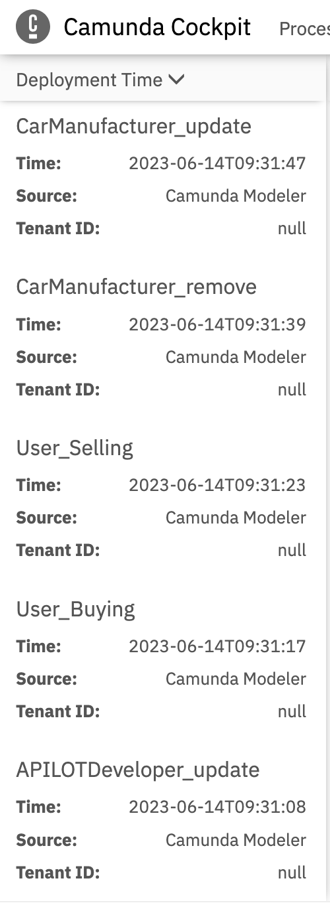

# Enterprise Integration 2023 Project

This project was developed by Group 2 composed by Beatriz Urbano 96729 and Maria Campos 95629.

## Architecture of the AVaaS

In the following diagram we can observe the relationships between the entities of the AVaaS system in the perspective of a database.


## Information Flow

Considering the architeture of the AVaaS and the uses cases the following information flow diagramas were developed.


## Database configuration
In the RDS folder, there can be found an SQL file that specifies the tables and some examples values for this project, the commands were sent by MySQL Workbench after logging into the AWS RDS instance. The terraform script specifies the creation of this instance.

This project uses Quarkus, the Supersonic Subatomic Java Framework.

## Running the application in dev mode

You can run your application in dev mode that enables live coding using:
```shell script
./mvnw quarkus:dev
```
You can run the last use case ( IQ, EQ, AQ Autonomous driving) using:
```shell script
./mvnw quarkus:dev -Dquarkus.runner=org.ie.kafka.AVEventProducer
```
The application will be available at http://localhost:8080/q/swagger-ui

## Kafka producer and consumer high availability mechanism

In the micro-services folder, there can be found a script to automate the installation of Kafka and Zookeeper on an AWS instance as well as a Terraform script that creates a Kafka cluster. 

We chose to create topics by brand, so that whenever a new Car Manufacturer brand is created, a new Kafka topic is created. The APILOT catalog works in a similar manner.

Unfortunately we were not able to run the brokers and produce the topics since we were getting errors such as "Broker not available" or "Broker replication factor bigger than available brokers", however in AV.java and APilot.java files there is still the code to produce a topic, even though it doesn't run.

In theory, what we wished to accomplish was upon a POST request (creating a brand) a topic for that brand and the producer would be Car Manufacture, who would show the AVs available (for example: Nissan would send all the available AV). Similarly for APILOT, it would show all the software available.

The command to run for APILOT would be:
 /usr/local/kafka/bin/kafka-console-producer.sh --broker-list <Instance1_DNS_NAME>:9092,<Instance2_DNS_NAME>:9092,<Instance3_DNS_NAME>:9092 --topic APilot_Catalog_X (X being the number of the catalog we wished to see)

/usr/local/kafka/bin/kafka-console-consumer.sh --broker-list<Instance1_DNS_NAME>:9092,<Instance2_DNS_NAME>:9092,<Instance3_DNS_NAME>:9092 --topic APilot_Catalog_X

The command to run for Car Manufacturer would be:
/usr/local/kafka/bin/kafka-console-consumer.sh --broker-list <Instance1_DNS_NAME>:9092,<Instance2_DNS_NAME>:9092,<Instance3_DNS_NAME>:9092 --topic Manufacturer_Catalog_X (X being the number of the catalog we wished to see)

/usr/local/kafka/bin/kafka-console-consumer.sh --broker-list <Instance1_DNS_NAME>:9092,<Instance2_DNS_NAME>:9092,<Instance3_DNS_NAME>:9092 --topic APilot_Catalog_X

## Implementation of the use cases

The implementations can be found in java/org/ie/services folder.


## IQ, EQ, AQ Autonomous driving

The implementation can be found in java/org/ie/kafka

**Component A** is composed by: AVEventProducer.java, AVEventConsumer.java and ApilotProducer.java

- AVEventProducer: produces random values for all the AVEvent attributes and sends it as a string message to the topic "av-event" (in the picture below we can see the AVEvent structure):


- AVEventConsumer: consumes the messages contained in the "av-event" topic, saves the object and calls the ApilotProducer (mediation)

- ApilotProducer: by receiving the AVEvent object it sends to the "apilot" topic the apilot object with the attributes it defined

**Component B** is composed by: DecisionConsumer.java and DecisionProducer.java

- DecisionConsumer: consumes the message from the "apilot" topic and makes the decisions (apilot-funcionality) to pilot the AV. It then calls the DecisionProducer

- DecisionProducer: sends to the "apilot-functionality" topic the decisions (apilot) as a string to be consumed by component C

**Component C** is composed by: ApilotConsumer.java and AVResultProducer.java

- ApilotConsumer: consumes messages from topic "apilot-functionality" but only saves the needed information (mediation) that is going to be sent and needed by the component D (Camunda). Its also in this stage that we use the MAP API! We send the location of our av in a request to the TomTom services and using the reverse geocoding method, our coordinates are transformed into something that is humanly readable like this:



The "municipalitySubdivision" value is going to be useful for the Camunda in the business rule to make recommendations based on the av location.

- AVResultProducer: after the connection between ApilotConsumer and Camunda, the information retrieved is going to be sent to the topic "av-result".

**Component** D is composed by : Camunda

- Business rule:


## BPMN Files
We developed BPMN files for each use case. You can check them in the folder BPMN/. We used the Camunda Modeler and all BPMNs were developed using Camunda Platform 7, the processes were then deployed to this REST Endpoint.

```shell script
http://ec2-44-211-150-240.compute-1.amazonaws.com:8080/engine-rest
```

To test the Camunda Engine, open the following URL in your browser (the default user and password is demo).
```shell script
http://<YOUR AWS EC2 NAME>:8080/camunda
```
Here is an example of the Camunda Cockpit showcasing some of the deployed processes.


## Kong

We ran the terraform script called "EC2Kong.tf" to create a AWS instance with Kong already installed (provided by the deploy.sh script). We then logged in to our Kong AWS instance and verified the installation which returned a status code of 200.


We then tested the installation locally.


We added our services to Kong pointing to the appropriate Quarkus API.


We also added routes for each service.


We also used **Konga** to manage all the services and routes we had created.


# TESTS

- To test the services:
We can test by hand using the swagger-ui to see if we can create a request to, for example, add an APilot and see if the APilot database values are updated;
We can also test the developed microservices with Camunda by logging into Camunda and in the Cockpit, clicking on "Start Process" and indicating the appropriate variables.

- To test the last use case:
We can run it by using the command previously mentioned in the **Running the application in dev mode** section. After that if we check the terminal, the messages sent should appear.

When a producer sends the message it appears: 
"This is the message to send = M" , where M is the message
"Sending new message to Kafka topic= T", where T is the topic name
"APilot Producer sent message..."


When a consumer reads/consumes the message it appears: 
"Consumed AV_Event: Id = I Value = V", where I is the Id of the av and V is the value of the record.

